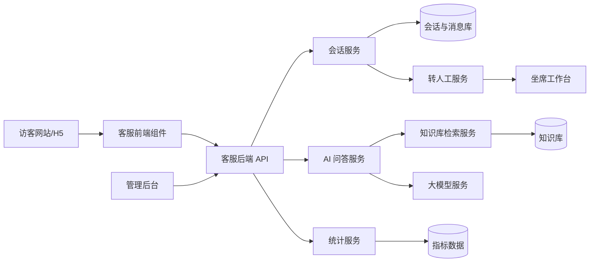
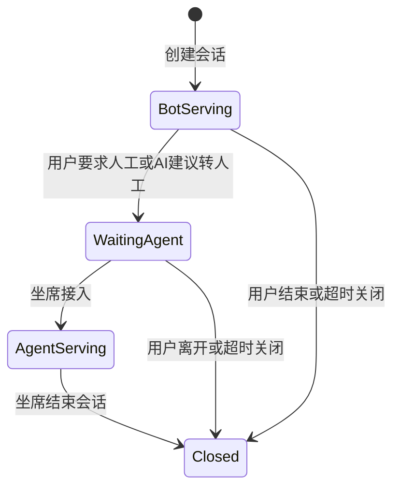
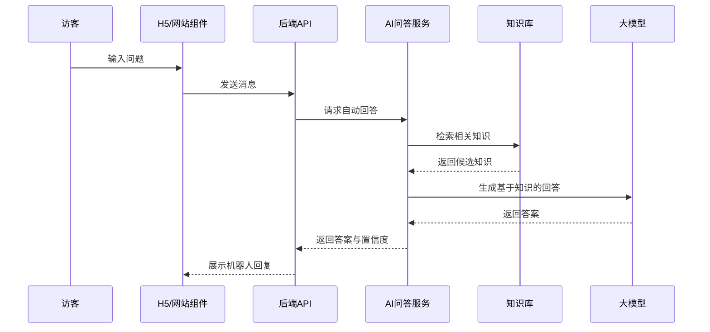
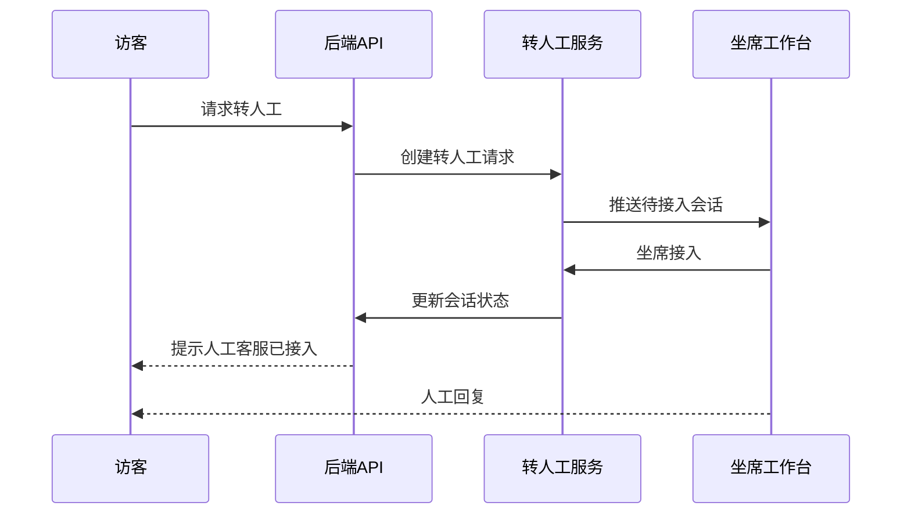

# 智能客服系统设计文档

## 1. 文档信息

| 项目 | 内容 |
| --- | --- |
| 系统名称 | 智能客服系统 |
| 版本 | MVP v1.0 |
| 目标渠道 | 网站 / H5 |
| 业务场景 | 通用售前售后客服 |
| 核心目标 | 提升常见问题自动解决率，并在无法解决时平滑转人工 |
| 首期边界 | 不接入订单、物流、会员、CRM、ERP 等外部业务系统 |

## 2. 背景与目标

本系统面向通用商业网站或 H5 场景，为访客提供 7x24 小时基础咨询能力。系统通过知识库增强的 AI 问答处理常见售前、售后、服务政策类问题。当机器人无法确定答案、知识库未命中、用户明确要求人工客服时，系统将当前会话和上下文转交给人工坐席。

MVP 阶段重点完成从“用户咨询 -> AI 回答 -> 转人工 -> 人工处理 -> 会话沉淀 -> 知识库优化”的最小闭环。

## 3. 设计原则

- 可控回答：AI 回答必须基于知识库内容，不允许编造订单、物流、退款进度等业务数据。
- 快速上线：优先完成高频客服闭环，避免首期引入复杂多渠道、多租户和深度业务集成。
- 人机协同：机器人负责常见问题，人工负责复杂问题和低置信问题。
- 可运营：知识库应方便运营人员维护，线上问题应能反哺知识库优化。
- 可追踪：会话、消息、转人工、评价和关键指标都需要可查询、可统计。
- 模块化优先：文档中的模块表示业务能力边界，不映射为单个代码文件或单个孤立页面；模块之间通过稳定接口协作，避免跨模块直接耦合。

## 4. 系统范围

### 4.1 首期包含

- 网站 / H5 客服聊天入口。
- 基于知识库的 AI 自动问答。
- 低置信度或用户主动要求时转人工。
- 人工坐席工作台。
- 知识库运营后台。
- 会话记录查询。
- 基础数据看板。
- 会话结束评价。

### 4.2 首期不包含

- 微信、企微、App、邮件、电话等多渠道接入。
- 订单、物流、会员、CRM、ERP 等业务系统对接。
- 工单系统。
- 复杂排班、技能组路由、SLA 管理。
- 多租户商业化管理。
- AI 自动改写并发布知识库内容。

## 5. 用户角色

| 角色 | 说明 | 主要能力 |
| --- | --- | --- |
| 访客 | 网站或 H5 用户 | 发起咨询、查看 AI 回复、请求人工、提交评价 |
| 客服坐席 | 人工客服人员 | 接待转人工会话、查看上下文、回复用户、结束会话 |
| 知识库运营 | 负责维护客服知识 | 新增、编辑、停用、分类、检索知识条目 |
| 管理员 | 系统管理人员 | 管理账号、角色、查看会话和数据报表 |

## 6. 总体架构

### 6.1 架构说明

- 客服前端组件负责用户聊天 UI、消息发送、消息展示、人工入口和满意度评价。
- 客服后端 API 负责统一鉴权、会话管理、消息收发、后台接口和数据访问。
- AI 问答服务负责知识库检索、提示词组装、答案生成、置信度判断和兜底策略。
- 转人工服务负责会话状态切换、上下文传递、坐席接待和会话结束。
- 管理后台负责知识库维护、会话查询、账号管理和基础报表。

### 6.2 模块化边界与演进原则

本设计采用“模块化单体优先，按能力拆分，可平滑演进为独立服务”的架构策略。MVP 阶段不追求微服务数量，而是先保证领域边界清晰、接口稳定、数据归属明确。

| 模块 | 主要职责 | 对外接口 | 数据归属 |
| --- | --- | --- | --- |
| 会话模块 | 会话创建、状态流转、消息归档 | 会话 API、消息 API、内部事件 | 会话、消息 |
| AI 编排模块 | 知识检索、提示词组装、模型调用、置信度判断 | 自动回答接口、低置信事件 | AI 调用日志、回答结果 |
| 知识库模块 | FAQ、文档、分类、标签、启停状态 | 知识管理 API、检索接口 | 知识条目、分类、标签 |
| 转人工模块 | 转人工请求、坐席接入、上下文传递 | 转人工 API、会话分配事件 | 转人工记录 |
| 坐席模块 | 坐席状态、人工回复、会话结束 | 坐席工作台 API、实时消息通道 | 坐席、接待记录 |
| 报表模块 | 指标聚合、看板查询、运营分析 | 报表查询 API | 指标快照、统计结果 |
| 权限模块 | 登录、角色、权限校验、审计 | 鉴权中间件、权限服务 | 账号、角色、审计日志 |

模块化约束：

- 每个模块拥有自己的领域对象和业务规则，不通过共享“万能服务”承载所有逻辑。
- 跨模块调用优先使用应用服务接口或领域事件，避免直接修改其他模块的数据。
- 数据库可以物理共库，但逻辑上按模块归属表和访问权限；后续拆服务时以模块为拆分单位。
- 前端也按能力拆分为客服组件、坐席工作台、知识库后台、报表后台，而不是集中在一个大页面中。
- 文档中的 API 分组表达业务能力，不要求实现为单个控制器、单个文件或固定目录结构。

## 7. 核心模块设计

以下模块是业务能力模块，不是具体代码文件清单。研发实现时应保持“高内聚、低耦合”：每个模块内部可以包含接口层、应用层、领域逻辑、数据访问和测试代码，模块之间只暴露必要能力。

### 7.1 客户端聊天模块

功能：

- 展示客服入口，例如网站右下角浮窗或独立 H5 聊天页。
- 展示欢迎语和常见问题快捷入口。
- 支持访客发送文本消息。
- 展示机器人回复、人工回复、系统提示和转人工状态。
- 支持用户主动点击“转人工”。
- 会话结束后支持满意度评价。

关键规则：

- 新访客进入时自动创建或恢复最近未结束会话。
- 访客消息发送后进入消息队列或同步处理流程。
- 如果当前会话已转人工，则消息直接进入人工坐席通道，不再触发 AI 自动回答。

### 7.2 AI 问答模块

功能：

- 根据用户问题检索知识库。
- 将命中的知识片段提供给大模型生成自然语言答案。
- 输出答案、引用知识条目、置信度和后续动作建议。
- 低置信度时返回兜底话术并建议转人工。

回答策略：

- 知识库命中且置信度达标：返回 AI 答案。
- 知识库未命中：提示暂未找到准确答案，并引导转人工。
- 涉及订单、物流、退款进度、账号隐私等业务数据：不编造结果，直接建议人工处理。
- 用户连续追问仍未解决：触发转人工建议。
- 用户明确输入“人工客服”“转人工”等意图：直接进入转人工流程。

### 7.3 知识库模块

功能：

- 支持 FAQ 类型知识条目。
- 支持文档型知识条目。
- 支持分类、标签、关键词、启用状态。
- 支持新增、编辑、删除或停用。
- 支持按标题、内容、分类、标签搜索。
- 支持基础导入导出。

知识条目字段建议：

| 字段 | 说明 |
| --- | --- |
| id | 知识条目唯一 ID |
| title | 标题 |
| content | 正文内容 |
| category_id | 分类 ID |
| tags | 标签 |
| keywords | 关键词 |
| status | draft / enabled / disabled |
| updated_by | 最近编辑人 |
| updated_at | 最近更新时间 |

### 7.4 转人工模块

功能：

- 支持用户主动转人工。
- 支持 AI 低置信度自动建议转人工。
- 支持坐席接入会话。
- 坐席可查看转人工前的完整聊天上下文。
- 坐席可结束会话。

状态流转：

### 7.5 坐席工作台

功能：

- 查看待接入会话列表。
- 接入会话。
- 查看用户问题和机器人历史回复。
- 向用户发送文本回复。
- 结束会话。
- 标记问题类型。

MVP 限制：

- 不做复杂技能组分配。
- 不做坐席排班。
- 不做多坐席协同处理同一会话。

### 7.6 管理后台

功能：

- 账号和角色管理。
- 知识库管理。
- 会话记录查询。
- 基础数据看板。
- 满意度评价查看。

后台菜单建议：

| 菜单 | 功能 |
| --- | --- |
| 首页看板 | 咨询量、自动解决率、转人工率、满意度 |
| 会话记录 | 查询用户会话、消息历史、处理状态 |
| 知识库 | 维护 FAQ、文档、分类、标签 |
| 坐席管理 | 管理客服账号和启用状态 |
| 系统设置 | 欢迎语、兜底话术、转人工提示 |

## 8. 核心数据模型

以下模型用于表达核心领域对象和数据边界，不代表必须一一对应为单表或单文件。实际落库时可根据查询性能、审计要求和扩展性拆分为主表、明细表、索引表或事件表。

### 8.1 Conversation

| 字段 | 类型 | 说明 |
| --- | --- | --- |
| id | string | 会话 ID |
| visitor_id | string | 访客 ID |
| status | string | bot_serving / waiting_agent / agent_serving / closed |
| assigned_agent_id | string | 当前坐席 ID，可为空 |
| source | string | web / h5 |
| created_at | datetime | 创建时间 |
| updated_at | datetime | 更新时间 |
| closed_at | datetime | 关闭时间 |

### 8.2 Message

| 字段 | 类型 | 说明 |
| --- | --- | --- |
| id | string | 消息 ID |
| conversation_id | string | 会话 ID |
| sender_type | string | visitor / bot / agent / system |
| sender_id | string | 发送者 ID |
| content | text | 消息内容 |
| message_type | string | text / system |
| created_at | datetime | 发送时间 |

### 8.3 KnowledgeArticle

| 字段 | 类型 | 说明 |
| --- | --- | --- |
| id | string | 知识 ID |
| title | string | 标题 |
| content | text | 内容 |
| category_id | string | 分类 ID |
| tags | string[] | 标签 |
| status | string | draft / enabled / disabled |
| created_by | string | 创建人 |
| updated_by | string | 更新人 |
| created_at | datetime | 创建时间 |
| updated_at | datetime | 更新时间 |

### 8.4 Agent

| 字段 | 类型 | 说明 |
| --- | --- | --- |
| id | string | 坐席 ID |
| name | string | 坐席名称 |
| account | string | 登录账号 |
| status | string | enabled / disabled |
| online_status | string | online / offline / busy |
| created_at | datetime | 创建时间 |

### 8.5 SatisfactionRating

| 字段 | 类型 | 说明 |
| --- | --- | --- |
| id | string | 评价 ID |
| conversation_id | string | 会话 ID |
| visitor_id | string | 访客 ID |
| score | number | 评分 |
| comment | text | 评价内容 |
| created_at | datetime | 创建时间 |

## 9. 核心流程

### 9.1 AI 自动问答流程

### 9.2 转人工流程

## 10. API 设计建议

以下 API 只定义模块间和前后端交互的能力边界。实现时可按领域模块拆分路由、控制器、服务和权限策略，不应把所有接口集中到单一文件或单一处理器中。

### 10.1 客户端 API

| 方法 | 路径 | 说明 |
| --- | --- | --- |
| POST | /api/conversations | 创建会话 |
| GET | /api/conversations/{id} | 获取会话详情 |
| POST | /api/conversations/{id}/messages | 发送访客消息 |
| GET | /api/conversations/{id}/messages | 获取消息列表 |
| POST | /api/conversations/{id}/handoff | 请求转人工 |
| POST | /api/conversations/{id}/rating | 提交满意度评价 |

### 10.2 坐席 API

| 方法 | 路径 | 说明 |
| --- | --- | --- |
| GET | /api/agent/conversations/waiting | 获取待接入会话 |
| POST | /api/agent/conversations/{id}/accept | 接入会话 |
| POST | /api/agent/conversations/{id}/messages | 发送人工回复 |
| POST | /api/agent/conversations/{id}/close | 结束会话 |

### 10.3 后台 API

| 方法 | 路径 | 说明 |
| --- | --- | --- |
| GET | /api/admin/knowledge | 查询知识条目 |
| POST | /api/admin/knowledge | 创建知识条目 |
| PUT | /api/admin/knowledge/{id} | 更新知识条目 |
| POST | /api/admin/knowledge/{id}/enable | 启用知识条目 |
| POST | /api/admin/knowledge/{id}/disable | 停用知识条目 |
| GET | /api/admin/reports/overview | 获取首页指标 |

## 11. 关键指标

| 指标 | 说明 |
| --- | --- |
| 咨询量 | 指定时间内创建的会话数 |
| 机器人回答量 | 由 AI 回复的消息数 |
| 自动解决率 | 未转人工且正常结束的会话数 / 总会话数 |
| 转人工率 | 转人工会话数 / 总会话数 |
| 人工首次响应时长 | 会话进入待接入后到坐席首次回复的时间 |
| 满意度 | 用户提交的平均评分 |
| 知识未命中问题数 | 触发兜底或转人工的问题数量 |

## 12. 权限设计

| 权限 | 访客 | 坐席 | 知识库运营 | 管理员 |
| --- | --- | --- | --- | --- |
| 发起会话 | 是 | 否 | 否 | 否 |
| 回复人工会话 | 否 | 是 | 否 | 是 |
| 查看会话记录 | 仅本人会话 | 处理范围内 | 可查看 | 可查看 |
| 维护知识库 | 否 | 否 | 是 | 是 |
| 查看报表 | 否 | 否 | 可查看 | 可查看 |
| 管理账号 | 否 | 否 | 否 | 是 |

## 13. 安全与合规

- 访客身份使用匿名 visitor_id，后续如接入会员系统再绑定真实用户。
- 后台和坐席端必须登录后访问。
- 不在 AI 提示词中注入无关敏感信息。
- 聊天记录、知识库编辑记录和坐席操作应保留审计信息。
- AI 不得返回未验证的订单、物流、退款、账户等敏感信息。
- 管理后台接口需要按角色校验权限。

## 14. 异常与兜底策略

| 场景 | 处理方式 |
| --- | --- |
| 知识库无匹配 | 返回兜底话术，建议转人工 |
| AI 服务不可用 | 提示系统繁忙，建议转人工 |
| 坐席不在线 | 提示当前人工客服繁忙，引导留言或稍后咨询 |
| 会话长时间无响应 | 自动关闭或标记超时 |
| 用户连续追问未解决 | 建议转人工 |
| 涉及业务数据查询 | 不生成具体结果，转人工处理 |

## 15. 部署建议

MVP 建议采用模块化单体后端加独立前端的方式快速上线。后端在一个部署单元内运行，但代码、接口、数据访问和测试按业务模块组织；后续可优先拆出 AI 编排、实时消息、报表统计等高负载模块。

建议组件：

- Web 客服组件：嵌入客户网站。
- 管理后台前端：供坐席、运营和管理员使用。
- 后端服务：按模块提供会话、消息、AI 编排、知识库、转人工、报表和权限 API。
- 数据库：存储会话、消息、知识库、账号和评价。
- 向量检索或全文检索组件：用于知识库召回。
- 大模型服务：用于基于知识片段生成回答。

## 16. 测试计划

### 16.1 功能测试

- 访客可以创建会话并发送消息。
- AI 可以根据已启用知识条目回答问题。
- 停用知识条目后，AI 不再基于该知识回答。
- 用户主动要求人工时，会话进入待接入状态。
- 坐席可以接入会话并回复用户。
- 坐席结束会话后，访客可以提交满意度评价。
- 后台可以查询完整会话历史。

### 16.2 边界测试

- 知识库无答案时不编造内容。
- AI 服务异常时能进入兜底流程。
- 坐席离线时用户能收到明确提示。
- 访客重复发送消息时不会创建重复会话。
- 已关闭会话不能继续发送普通消息。

### 16.3 指标测试

- 咨询量统计准确。
- 自动解决率统计准确。
- 转人工率统计准确。
- 人工首次响应时长统计准确。
- 满意度平均分统计准确。

## 17. 验收标准

- 网站 / H5 客服入口可正常发起咨询。
- 常见问题可由 AI 基于知识库自动回答。
- AI 无法回答时可触发转人工。
- 坐席可查看上下文、回复并结束会话。
- 运营可维护知识库并影响线上回答。
- 管理后台可查看会话记录和核心指标。
- 系统不会对订单、物流、退款进度等未接入数据生成虚假答案。

## 18. 后续演进路线

| 阶段 | 目标 | 主要能力 |
| --- | --- | --- |
| v1.0 | MVP 闭环 | H5 客服、AI 问答、基础转人工、知识库、报表 |
| v1.1 | 业务查询 | 对接订单、物流、会员等少量 API |
| v1.2 | 售后闭环 | 工单、问题分派、处理进度跟踪 |
| v2.0 | 多渠道客服 | 接入微信、企微、App、邮件等渠道 |
| v2.1 | 运营增强 | 质检、知识缺口分析、自动标签、坐席绩效 |
| v3.0 | 企业级能力 | 多租户、SLA、高可用、复杂权限和审计 |
