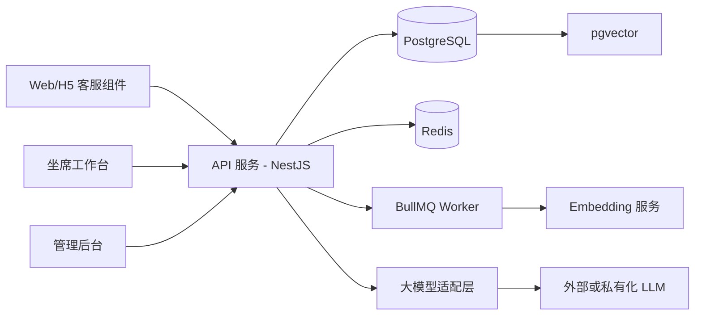

# 智能客服系统技术栈设计

## 1. 选型结论

本项目最适合采用“模块化单体 + 前后端分离 + PostgreSQL/pgvector + Redis + 可替换大模型适配层”的技术栈。

该方案适合当前 MVP：交付速度快、部署复杂度低、模块边界清晰，后续可按会话、AI 编排、知识库、转人工、报表等模块逐步拆分，不把系统设计绑定到单个文件、单个页面或过早的微服务架构。

## 2. 推荐技术栈

| 层级 | 推荐技术 | 用途 | 选型理由 |
| --- | --- | --- | --- |
| 客服前端组件 | React + TypeScript + Vite Library Mode | 网站 / H5 嵌入式聊天组件 | 适合打包为可嵌入 JS/CSS 组件，便于客户网站接入 |
| 坐席与管理后台 | React + TypeScript + Vite + Ant Design | 坐席工作台、知识库后台、报表后台 | 企业后台组件成熟，表单、表格、弹窗和权限页开发效率高 |
| 后端框架 | Node.js + TypeScript + NestJS | API、会话、知识库、AI 编排、权限 | 天然支持模块、依赖注入、控制器和服务分层，适合模块化单体 |
| 实时通信 | WebSocket / Socket.IO | 访客与坐席实时消息、坐席状态推送 | 双向通信稳定，适合人工客服接入和消息送达 |
| 普通 API | REST API | 后台管理、知识库、报表、账号权限 | 简单清晰，便于调试、权限控制和前后端协作 |
| 主数据库 | PostgreSQL | 会话、消息、知识库、账号、评价、审计 | 事务可靠，适合结构化业务数据和复杂查询 |
| 向量检索 | pgvector | 知识库语义检索 | 向量和业务数据同库管理，MVP 阶段避免额外引入独立向量数据库 |
| 关键词检索 | PostgreSQL Full Text Search | 标题、正文、标签、关键词搜索 | 与向量检索互补，支持混合召回 |
| 缓存与队列 | Redis + BullMQ | 坐席在线状态、限流、异步任务、知识向量化任务 | Redis 生态成熟，BullMQ 适合 Node.js 异步任务处理 |
| AI 能力 | 大模型适配层 + Embedding 服务 | RAG 问答、知识向量化、兜底判断 | 供应商可替换，避免业务代码直接绑定单一模型 API |
| 鉴权权限 | JWT + RBAC | 坐席、运营、管理员权限控制 | 实现简单，适合 MVP 后台权限模型 |
| 对象存储 | S3 兼容存储 / 本地存储起步 | 后续知识附件、导入文件、导出文件 | MVP 可本地化，后续平滑切到云存储 |
| 日志监控 | Pino / Winston + OpenTelemetry | 日志、链路追踪、AI 调用排查 | 方便定位会话、模型调用和转人工链路问题 |
| 部署 | Docker Compose | 本地、测试、MVP 生产部署 | 一份配置管理 API、前端、PostgreSQL、Redis 等多容器组件 |
| CI/CD | GitHub Actions 或同类流水线 | 测试、构建、镜像发布 | 简单通用，后续可接入云厂商部署流程 |

## 3. 模块化落地方式

### 3.1 后端模块

后端采用模块化单体，不按“一个大文件”组织逻辑，而按业务能力划分模块：

| 模块 | 主要职责 |
| --- | --- |
| conversation | 会话创建、状态流转、会话关闭 |
| message | 消息存储、消息查询、消息投递 |
| ai-orchestration | RAG 编排、提示词版本、模型调用、置信度判断 |
| knowledge | FAQ、文档、分类、标签、启停、导入导出 |
| retrieval | 向量检索、关键词检索、混合排序 |
| handoff | 转人工请求、排队、坐席接入 |
| agent | 坐席状态、接待记录、人工回复 |
| auth | 登录、JWT、RBAC、权限校验 |
| metrics | 自动解决率、转人工率、满意度、响应时长 |
| audit | 知识库编辑、坐席操作、敏感操作记录 |

模块约束：

- 模块只暴露必要的服务接口，不跨模块直接读写内部实现。
- 数据可以先放在同一个 PostgreSQL 实例中，但表、迁移和访问逻辑按模块归属。
- AI 模型、Embedding、短信、对象存储等外部能力必须通过适配器封装，便于替换供应商。
- 后续拆服务时优先拆高负载或强边界模块，例如 ai-orchestration、retrieval、metrics。

### 3.2 前端模块

前端不做单一大页面，按使用人群和运行场景拆分：

| 应用 | 说明 |
| --- | --- |
| web-widget | 嵌入客户网站的客服聊天组件 |
| agent-console | 坐席工作台，处理转人工会话 |
| admin-console | 知识库、账号、报表和系统设置后台 |
| shared-ui | 通用 UI 组件、主题、表单封装 |
| contracts | 前后端共享的 API 类型、枚举、事件类型 |

客户端聊天组件应独立打包和版本化，避免管理后台依赖客户网站运行环境。

## 4. 核心技术决策

### 4.1 为什么选择模块化单体

- MVP 阶段团队和业务复杂度有限，微服务会过早增加部署、链路追踪、数据一致性和运维成本。
- NestJS 的模块机制适合先在一个进程内建立边界，后续再按模块拆成独立服务。
- 模块化单体能兼顾上线速度和后续扩展，不把系统写成一个不可拆的大应用。

### 4.2 为什么 PostgreSQL + pgvector

- 会话、消息、知识库、权限、评价本来就是强结构化数据，PostgreSQL 是主库的自然选择。
- pgvector 可以把知识向量与知识条目放在同一个数据库中，降低 MVP 的运维复杂度。
- PostgreSQL Full Text Search 可与向量召回组合，形成“关键词 + 语义”的混合检索。
- 当知识规模、召回延迟或多租户隔离需求显著增加时，再评估 Qdrant、Milvus、Elasticsearch 等独立检索组件。

### 4.3 为什么前端使用 React + Vite

- 客服组件需要作为独立 JS/CSS 包嵌入网站，Vite 的 library build 更适合这类组件分发。
- 坐席和后台是典型管理界面，React + Ant Design 可以快速交付稳定表格、表单、弹窗和权限页。
- 前端应用拆分后，客服组件、坐席工作台、管理后台可以独立构建和发布。

### 4.4 为什么 AI 使用适配层

- 业务逻辑不直接调用具体模型 SDK，而是调用内部 `ModelProvider`、`EmbeddingProvider`、`Retriever` 接口。
- 支持后续在不同模型供应商、私有化模型、托管向量库之间切换。
- AI 调用必须记录请求 ID、提示词版本、命中知识、置信度和兜底原因，便于排查幻觉和知识缺口。

## 5. 推荐运行架构

部署建议：

- MVP 使用 Docker Compose 部署 `api`、`worker`、`postgres`、`redis`、`admin-console` 和 `web-widget` 静态资源。
- `api` 负责同步请求、鉴权、会话、实时通信和后台接口。
- `worker` 负责知识导入、切片、Embedding 生成、报表聚合等异步任务。
- 前端静态资源通过 Nginx 或对象存储/CDN 分发。
- PostgreSQL 和 Redis 生产环境需要独立持久化、备份和监控。

## 6. 不建议首期采用

| 技术/方案 | 不建议原因 |
| --- | --- |
| 一开始就微服务化 | 增加部署、监控、链路追踪和数据一致性成本，MVP 收益不足 |
| MongoDB 作为主库 | 客服会话、权限、报表和知识库管理更依赖关系查询和事务 |
| 独立向量数据库首发 | 当前知识规模未知，先用 pgvector 可降低复杂度 |
| 纯大模型无知识库 | 容易幻觉，无法保证售前售后政策回答一致性 |
| 所有逻辑集中到单文件/单模块 | 后续难维护、难测试、难拆分，与客服系统长期演进冲突 |
| SSR 全栈框架作为核心后端 | 当前重点是实时客服、后台 API 和嵌入式组件，独立 NestJS 后端更清晰 |

## 7. 测试与质量工具

| 类型 | 建议工具 | 覆盖内容 |
| --- | --- | --- |
| 后端单元测试 | Jest / Vitest | 领域规则、状态流转、权限判断、AI 策略 |
| API 集成测试 | Supertest / Pact | 会话、消息、转人工、知识库接口 |
| 前端组件测试 | Vitest + Testing Library | 聊天组件、后台表单、状态切换 |
| E2E 测试 | Playwright | 访客咨询、AI 回复、转人工、坐席回复、评价 |
| RAG 评估 | 自建问答集 + 命中率/拒答率评估 | 知识命中、答案准确性、低置信兜底 |
| 静态质量 | ESLint + Prettier + TypeScript strict | 类型安全、代码风格、基础缺陷 |

## 8. 版本与演进策略

| 阶段 | 技术形态 | 说明 |
| --- | --- | --- |
| v1.0 MVP | 模块化单体 + PostgreSQL/pgvector + Redis | 最快完成 H5 客服、知识库问答、基础转人工 |
| v1.1 | 增加业务 API 适配模块 | 接入订单、物流、会员等少量接口 |
| v1.2 | 拆分 Worker 与检索能力 | 知识导入、Embedding、报表聚合异步化 |
| v2.0 | 独立检索或 AI 编排服务 | 当知识规模和并发明显增长时拆分 |
| v3.0 | 多渠道与企业级部署 | 多租户、SLA、审计、高可用、Kubernetes |

## 9. 参考依据

- [NestJS Modules](https://docs.nestjs.com/modules)：模块组织、导入导出和模块公共接口。
- [Vite Library Mode](https://vite.dev/guide/build#library-mode)：浏览器组件库打包能力。
- [Ant Design of React](https://ant.design/docs/react/introduce/)：企业级 React UI 组件。
- [PostgreSQL Full Text Search](https://www.postgresql.org/docs/current/textsearch.html)：全文检索能力。
- [pgvector](https://github.com/pgvector/pgvector)：PostgreSQL 向量相似度检索。
- [Redis Streams](https://redis.io/docs/latest/develop/data-types/streams/) 与 [BullMQ](https://docs.bullmq.io/)：异步任务和队列能力。
- [OpenAI Embeddings API](https://developers.openai.com/api/reference/resources/embeddings)：文本向量化接口形态，可作为 Embedding 服务参考。
- [Docker Compose](https://docs.docker.com/compose/)：多容器应用定义与运行。
